<h2>Screenshots for Social Networking app Era</h2>

https://erawish.herokuapp.com

<h3>Desktop mode</h3>
<h5>Screenshot 1</h5>
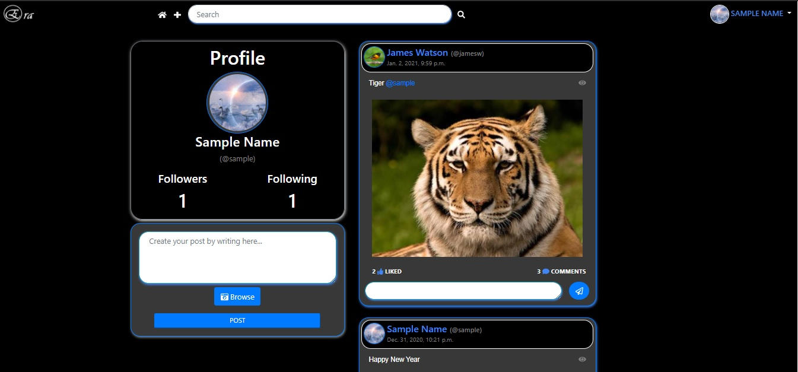
<h5>Screenshot 2</h5>
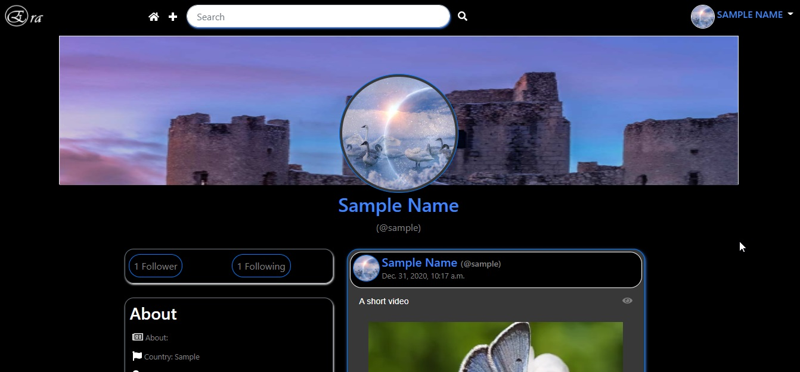
<h5>Screenshot 3</h5>
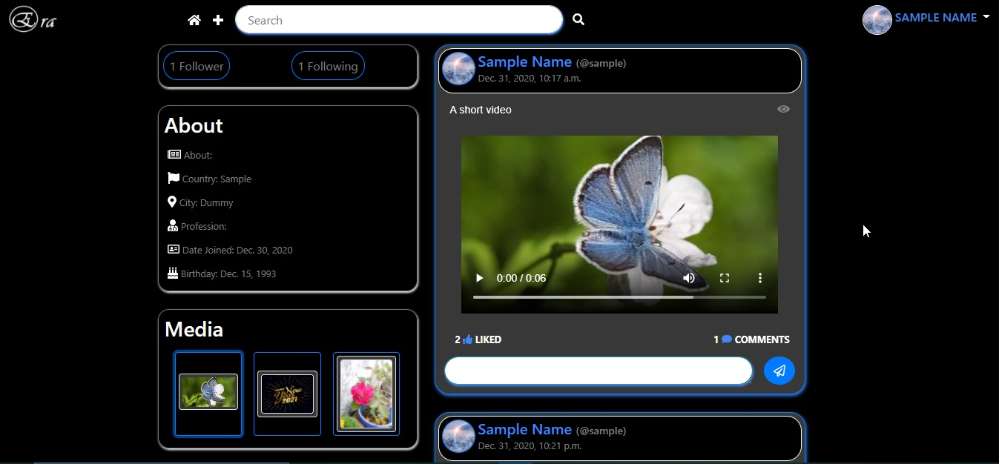
<h5>Screenshot 4</h5>
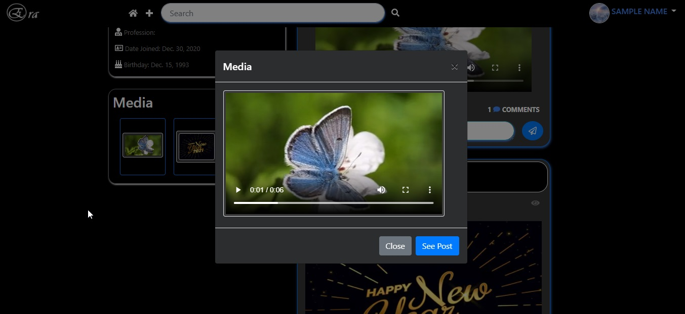
<h5>Screenshot 5</h5>
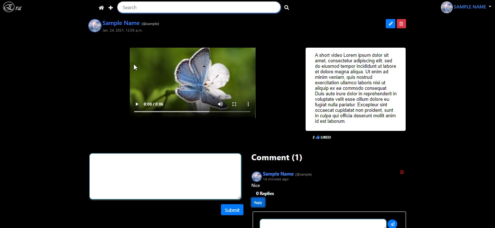
<h5>Screenshot 6</h5>
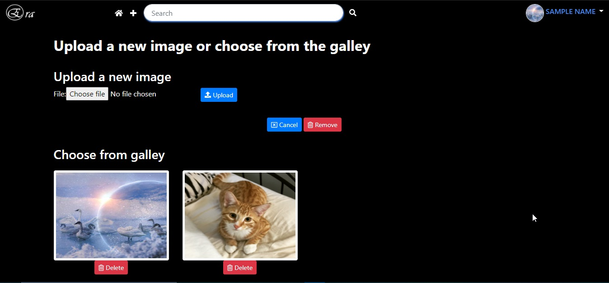
<h5>Screenshot 7</h5>
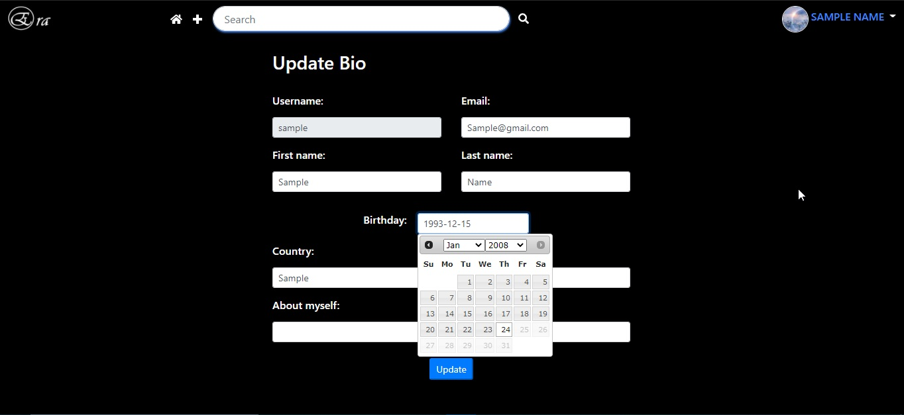
<h3>Mobile mode</h3>
<h5>Screenshot 1</h5>
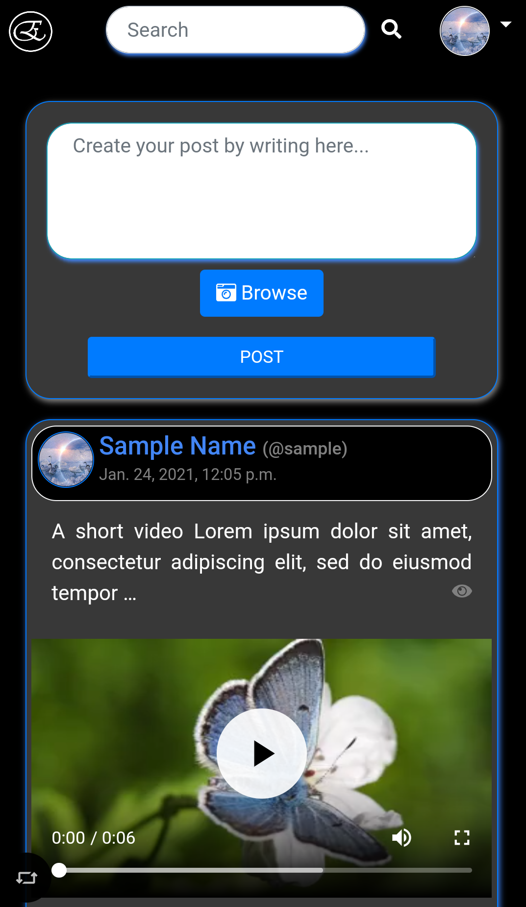
<h5>Screenshot 2</h5>
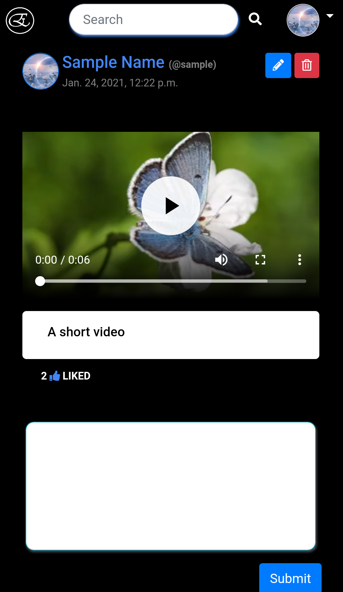
<h5>Screenshot 3</h5>
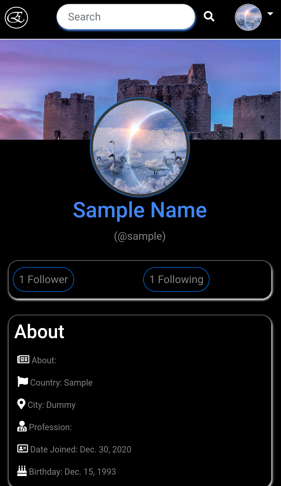
<h5>Screenshot 4</h5>
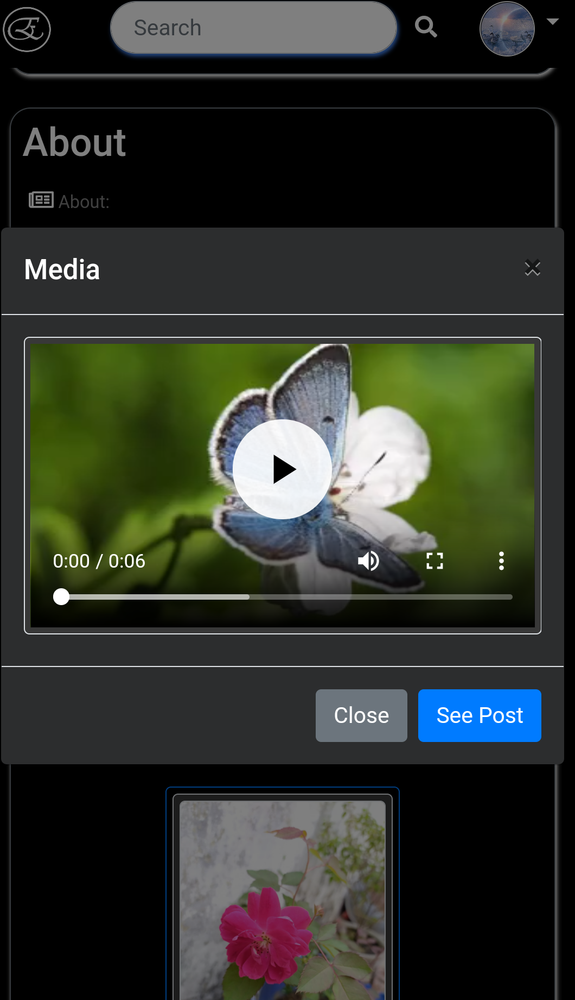
<h5>Screenshot 5</h5>
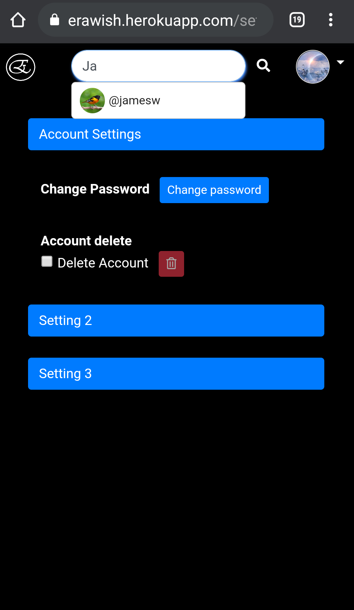